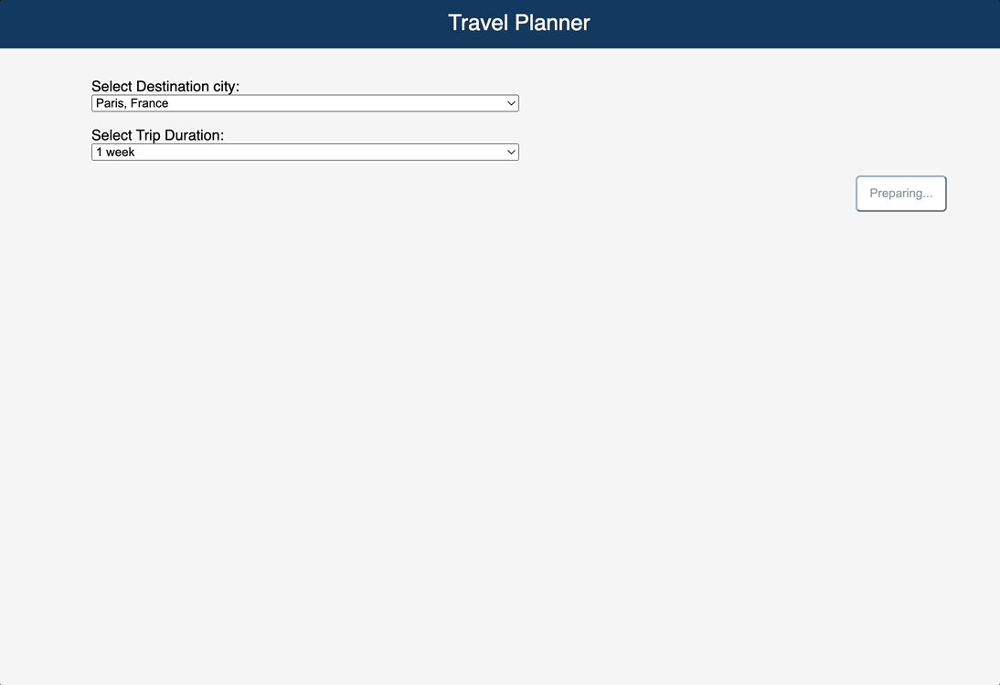

# Qwik Trip planner App ⚡️

- [Overview](#overview)
- [Development](#development)
- [Deployment](#deployment)

---

## Overview

This is a demo application using [open-ai](https://platform.openai.com/docs/overview) chat endpoint, [QwikCity](https://qwik.builder.io/qwikcity/overview/) and Http streaming to provide a trip planning web application.



## Development

Development mode uses [Vite's development server](https://vitejs.dev/). The `dev` command will server-side render (SSR) the output during development.

```shell
npm dev # or `yarn dev`
```

> Note: you will need to create `.env.local` file and add `OPEN_AI_API_KEY={OPEN_AI_API_KEY_TOKEN}` to be able to use Open AI endpoints. create a new key using [Open AI API keys](https://platform.openai.com/account/api-keys)

## Deployment

The application is being deployed to AWS using [serverles](https://www.serverless.com/).

### Deploy

```shell
npm deploy --param "OPEN_AI_API_KEY={OPEN_AI_API_KEY_TOKEN}"
```

### Preview locally

```shell
npm serve --param "OPEN_AI_API_KEY={OPEN_AI_API_KEY_TOKEN}"
```
